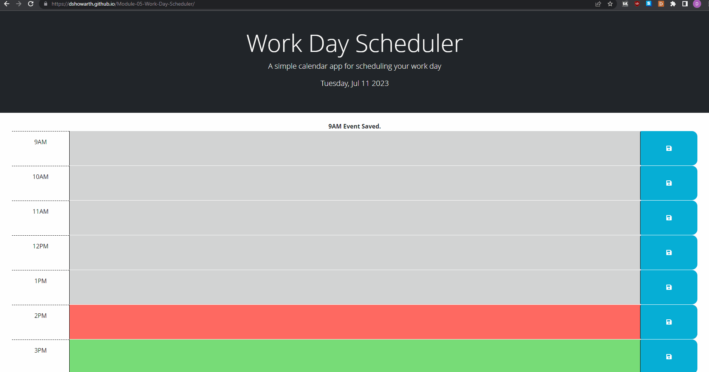

# Work Day Scheduler

## Description
This is a simple planner to help you track and manage events during the workday (just from 9am-6pm). 

(Example captured at 2:10pm)
## Usage
Go to URL https://dshowarth.github.io/Module-05-Work-Day-Scheduler/  
Take any events, appointments, or dreams you'd like to track to the appropriate time block. Then, click the Save button on the right hand side to store it all locally for future access. 

## Technologies Used
- HTML
- CSS
- Javascript
- Jquery
- DayJS

## Credits
Starter code taken from https://github.com/coding-boot-camp/crispy-octo-meme/  
Gif captured with https://github.com/NickeManarin/ScreenToGif/  
Font from https://fonts.google.com/  
Icon from https://www.fontawesome.com/  